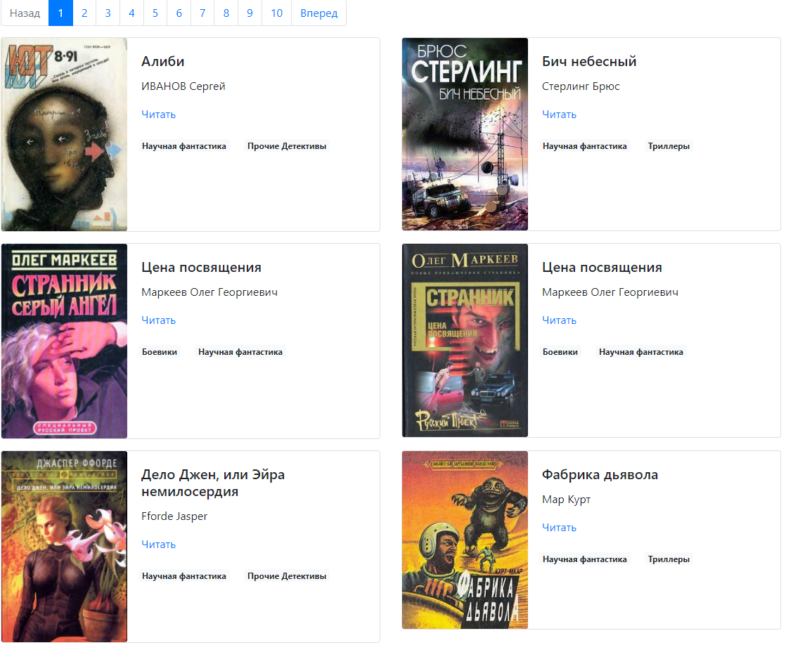

# Parser of books & your own offline library

You can download books, covers of books from web-site [tululu.org](http://tululu.org/) automatically. Besides, you can get json-file with data of your books. 
You can use it for layout of your own offline library like [this](https://mokkofm.github.io/book-parsing/pages/). 



### How to install

* Dowload the code
* Check that you have Python 3  
* Install requirements:  
```sh
$ pip install -r requirements.txt
```
* How to start parser  
```sh
python parse_tululu_category.py
```

### Arguments for parsing

You can use positional arguments:  
`--start_page` - You can choose first page to download books, default=1  
`--end_page` - You can choose last page to download books, default=1  
`--dest_folder` - You can check current folder with script  
`--skip_json` - You can skip downloading json  
`--skip_txt` - You can skip downloading books  
`--skip_images` - You can skip downloading images  

### How to make layout of library 
First of all, start parser. After that you will find downloaded books and images in `media` folder.
Besides, you can find json-file in `static` folder. 

```
python render_website.python
```
You can find your own library by link: [http://127.0.0.1:5500/pages/index1.html](http://127.0.0.1:5500/pages/index1.html).
You library can work offline as well. 

### Purpose

Code was writing for learning purpose as a part of course for web-developers [dvmn.org](https://dvmn.org/).